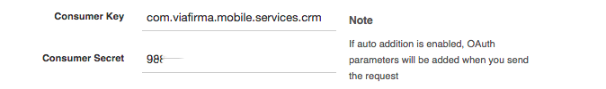

## Uso de la capa de servicios Rest

### Ejemplo de uso de servicios rest haciendo uso de postman https://chrome.google.com/webstore/detail/postman-rest-client/fdmmgilgnpjigdojojpjoooidkmcomcm

Envio desde el CRM un mensaje que solo genere el documento pdf, IMPORTANTE el código del workflow tiene que ser EX002

````
{
  "version" : "00001",
  "workflow" : {
    "code" : "EX002",
    "history" : [ ]
  },
  "notification" : {
    "text" : "Generar pdf",
    "detail" : "Ejemplo que solo genera un pdf y ejecuta el callback según lo tenga configurado" 
  },
  "document" : {
    "templateCode" : "022_example",
    "templateType" : "docx",
    "items" : [ {
      "key" : "KEY_01",
      "type" : "text",
      "label" : "KEY_01",
      "required" : true,
      "disabled" : false
    }, {
      "key" : "KEY_02",
      "type" : "text",
      "label" : "KEY_02",
      "required" : false,
      "disabled" : false
    }, {
      "key" : "KEY_03",
      "type" : "text",
      "label" : "KEY_03",
      "required" : false,
      "disabled" : false
    }, {
      "key" : "KEY_04",
      "type" : "text",
      "label" : "KEY_04",
      "required" : false,
      "disabled" : false
    } ]
  }
}
````

En la pestaña de OAuth de postman tenemos que indicar los valores correctos en los campos 'Consumer Key' y 'Consumer Secret' tal cual podemos ver en la siguiente captura



Realizar una metición

